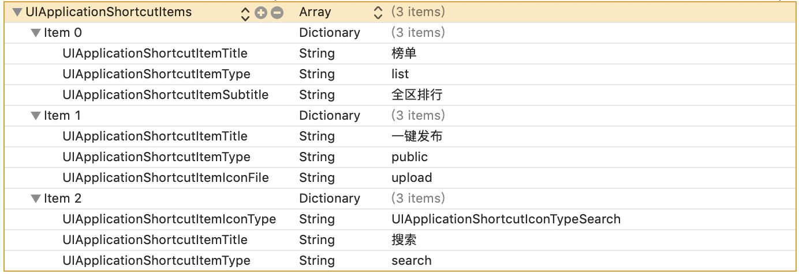
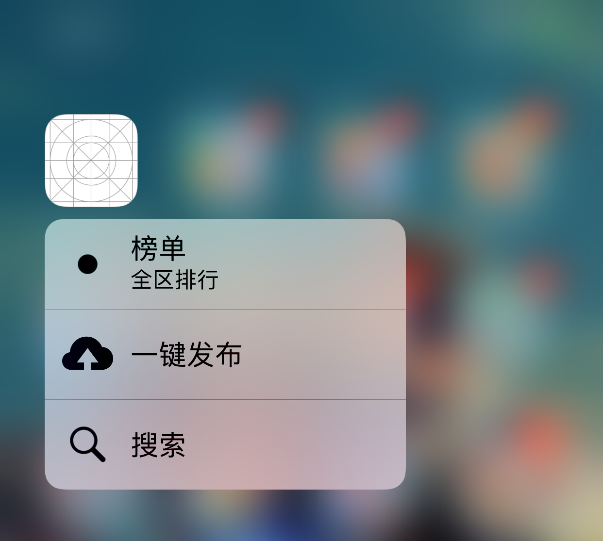
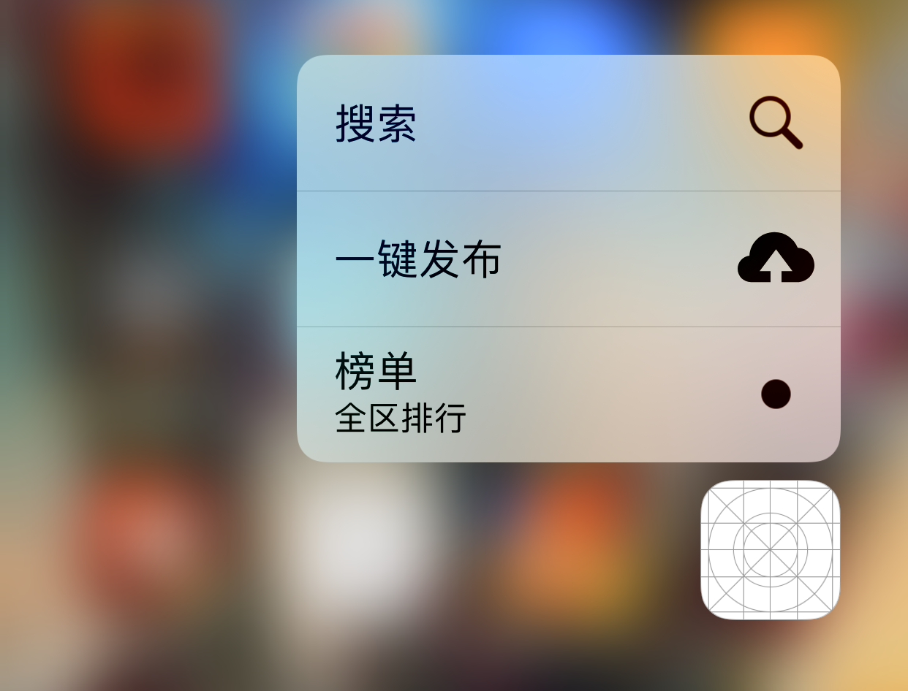

# iOS开发 - 3D Touch 应用系列一 - Quick Actions 创建桌面 Icon 快捷方式


## 个言

很久没发随笔了，有一年多了吧。期间也曾想继续去写随笔，但是因为各种原因而耽搁了。最近又想了一下，还是有很多东西想要写，想要分享，想要记录下来的东西。之后我也会不断写随笔，但不止于 iOS 的方向，也想去体验一下新东西。在此不多说，我们开始阅读正文吧。


## 简介

在支持 3D Touch 的设备上，Quick Actions 可以让用户更快，更少的操作步骤去完成他们最常做的事情，其中这么多操作可以通过主屏幕直接完成。比如用力地长按微信图标，会弹出诸如"扫一扫"和"我的二维码"等常用功能，这个我在加好友的情况下经常会用到，不是"扫"别人就是被别人"扫"。然后这是它的官方介绍，[3D Touch - iOS - Apple Developer](https://developer.apple.com/ios/3d-touch/)。

本文的 Demo 已放到 GitHub 上，Demo 请到 [GarveyCalvin/**iOS-Travel **](https://github.com/GarveyCalvin/iOS-Travel/tree/master/3D-Touch)下载。

>  支持的设备是在 iPhone 6S 和 6S Plus 及后续出的 iPhone 系列，系统则是从 iOS 9.0 开始支持 3D Touch。


## Info.plist 创建快捷方式

快捷方式支持在 Info.plist 里直接定义，主键是`UIApplicationShortcutItems`，它是一个数组`Array`。各个 Key 值可以在查看[Information Property List Key Reference](https://developer.apple.com/library/archive/documentation/General/Reference/InfoPlistKeyReference/Articles/iPhoneOSKeys.html#//apple_ref/doc/uid/TP40009252-SW36)，在这里简单地介绍一下各个 Key 的作用。

| Key                                     | 作用           |
| --------------------------------------- | -------------- |
| UIApplicationShortcutItemType(必需)     | 唯一标识       |
| UIApplicationShortcutItemTitle(必需)    | 显示的标题     |
| UIApplicationShortcutItemSubtitle(可选) | 显示的副标题   |
| UIApplicationShortcutItemIconType(可选) | 使用系统的图标 |
| UIApplicationShortcutItemIconFile(可选) | 使用项目的图标 |
| UIApplicationShortcutItemUserInfo(可选) | 附加的信息     |

以下是一个详细的例子，上述的 Key 除了 UIApplicationShortcutItemUserInfo 外，其它都实现了。



现在我们来看看运行效果，值得一提的是，图标分别在上半屏和下半屏的情况下，显示的排序是会不同的，具体运行效果如下所示。

**图标在上半屏**



**图标在下半屏**




## 判断用户点击了哪个快捷方式

通过在 AppDelegate.m 文件中实现 UIApplicationDelegate 的代理方法`application:performActionForShortcutItem:completionHandler:`，可以得知用户是从哪个快捷方式进来的，具体代码如下。

```objective-c
- (void)application:(UIApplication *)application performActionForShortcutItem:(UIApplicationShortcutItem *)shortcutItem completionHandler:(void (^)(BOOL))completionHandler  API_AVAILABLE(ios(9.0)) {
    NSLog(@"%s", __FUNCTION__);
    
    if ([shortcutItem.type isEqualToString:@"search"]) {
        NSLog(@"用户从快捷方式“搜索”进来的");
    } else if ([shortcutItem.type isEqualToString:@"list"]) {
        NSLog(@"用户从快捷方式“榜单”进来的");
    } else if ([shortcutItem.type isEqualToString:@"public"]) {
        NSLog(@"用户从快捷方式“一键发布”进来的");
    }
}
```


## 代码创建快捷方式

快捷方式也支持代码创建，每一个 UIApplicationShortcutItem 就是一个快捷方式，一般在 AppDelegate.m 文件中实现方法 `application:didFinishLaunchingWithOptions:` 里编写实现代码，代码比较易懂，这里就不再说明了。

```objective-c
- (BOOL)application:(UIApplication *)application didFinishLaunchingWithOptions:(NSDictionary *)launchOptions {
    NSLog(@"%s", __FUNCTION__);
    
    if (@available(iOS 9.0, *)) {
        UIApplicationShortcutIcon *searchIcon = [UIApplicationShortcutIcon iconWithType:UIApplicationShortcutIconTypeSearch];
        UIApplicationShortcutItem *search = [[UIApplicationShortcutItem alloc] initWithType:@"search" localizedTitle:@"搜索" localizedSubtitle:nil icon:searchIcon userInfo:nil];
        
        UIApplicationShortcutIcon *publicIcon = [UIApplicationShortcutIcon iconWithTemplateImageName:@"upload"];
        UIApplicationShortcutItem *public = [[UIApplicationShortcutItem alloc] initWithType:@"public" localizedTitle:@"一键发布" localizedSubtitle:nil icon:publicIcon userInfo:nil];
        
        UIApplicationShortcutItem *list = [[UIApplicationShortcutItem alloc] initWithType:@"list" localizedTitle:@"榜单" localizedSubtitle:@"全区排行" icon:nil userInfo:nil];
        
        application.shortcutItems = @[list, public, search];
    }
    
    return YES;
}
```


## 资料

本文的 Demo 已放到 GitHub 上，Demo 请到  [GarveyCalvin/**iOS-Travel **](https://github.com/GarveyCalvin/iOS-Travel/tree/master/3D-Touch)下载。

### 环境

Xcode: Version 10.1 (10B61)

测试机型：iPhone XS Max

测试系统：iOS 12.1


##  总结

无论是在 info.plist 或 代码 创建 Quick Actions 都比较简单，没什么很复杂的逻辑，学起来很容易。

Quick Actions 的使用情况还是比较多的，就我而言，我经常会用支付宝和微信放出来的"扫一扫"，支付宝的"乘车码"等等。

3D Touch 的应用范围不止这些，还有 Peek and Pop 和 Pressure Sensitivity，在以后或许会补上这系列的文章。


## 声明

博文作者：GarveyCalvin
博文出处：[http://www.cnblogs.com/GarveyCalvin/](http://www.cnblogs.com/GarveyCalvin)
本文版权归作者和博客园共有，欢迎转载，但须保留此段声明，并给出原文链接，谢谢合作！